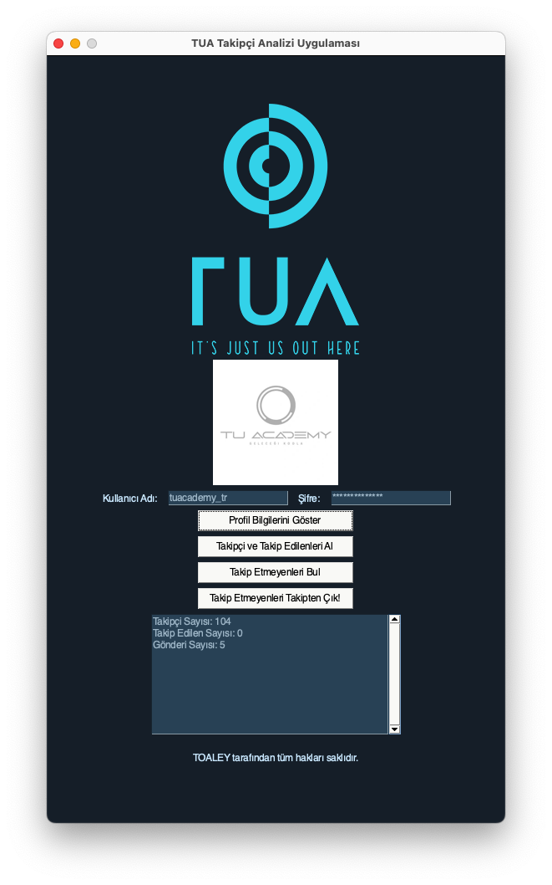

  

# TUA Takipçi Analizi Uygulaması

TUA Takipçi Analizi Uygulaması, Instagram hesabınızın takipçi ve takip edilenlerini analiz etmek için kullanılan bir araçtır. Ayrıca takip etmeyenleri bulmanıza ve isterseniz takipten çıkmanıza olanak sağlar.

## Özellikler

- Profil bilgilerini görüntüleme: Takipçi sayısı, takip edilen sayısı ve gönderi sayısı gibi profil bilgilerini görüntüleyebilirsiniz.
- Takipçi ve takip edilenleri alma: Instagram hesabınızın takipçilerini ve takip ettiğiniz kullanıcıları dosyalara kaydedebilirsiniz.
- Takip etmeyenleri bulma: Takip ettiğiniz kullanıcılar arasında sizi takip etmeyenleri bulabilirsiniz.
- Takipten çıkma: Takip etmeyen kullanıcılardan isteğe bağlı olarak takipten çıkabilirsiniz.

## Gereksinimler

Uygulamayı çalıştırmak için aşağıdaki gereksinimlere ihtiyacınız vardır:

- Python 3.x
- `instaloader` kütüphanesi
- `PySimpleGUI` kütüphanesi
- `PIL` (Python Imaging Library) kütüphanesi

## Kurulum

1. Bu GitHub deposunu yerel bir klasöre kopyalayın veya ZIP olarak indirin.

2. Gerekli kütüphaneleri yüklemek için aşağıdaki komutu çalıştırın:

pip install instaloader PySimpleGUI Pillow

3. `insta.py` dosyasını çalıştırın.

## Kullanım

1. Uygulamayı başlattığınızda, TUA logosu ve giriş alanları olan bir pencere görüntülenecektir.

2. Kullanıcı adı ve şifrenizi girin ve "Profil Bilgilerini Göster" düğmesine tıklayın.

3. Profil bilgileri (takipçi sayısı, takip edilen sayısı, gönderi sayısı) ve profil resmi görüntülenecektir.

4. "Takipçi ve Takip Edilenleri Al" düğmesine tıklayarak takipçi ve takip edilenleri dosyalara kaydedebilirsiniz.

5. "Takip Etmeyenleri Bul" düğmesine tıklayarak takip etmeyen kullanıcıları bulabilirsiniz.

6. "Takip Etmeyenleri Takipten Çık!" düğmesine tıklayarak takip etmeyen kullanıcılardan takipten çıkabilirsiniz.

7. Uygulamayı kapatmak için pencereyi kapatın veya konsoldan CTRL + C tuşuna basın.

## Ekran Görüntüsü

## Lisans

Bu proje, MIT Lisansı altında lisanslanmıştır. Detaylı bilgi için [LICENSE](LICENSE) dosyasını inceleyebilirsiniz.

## İletişim

Eğer herhangi bir sorunuz, öneriniz veya geri bildiriminiz varsa, lütfen iletişime geçmekten çekinmeyin.

- E-posta: [E-posta adresi](mailto:tolga97ugurlu@icloud.com)

---

Bu proje, Tolga Uğurlu tarafından oluşturulmuştur. Tüm hakları saklıdır.
